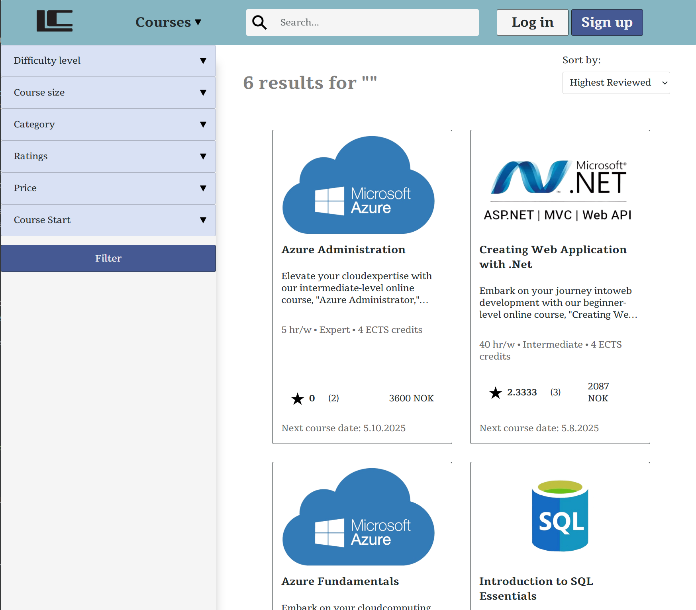
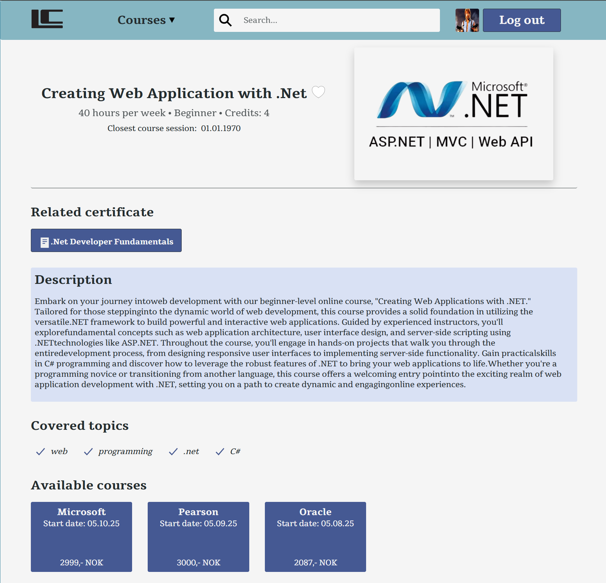
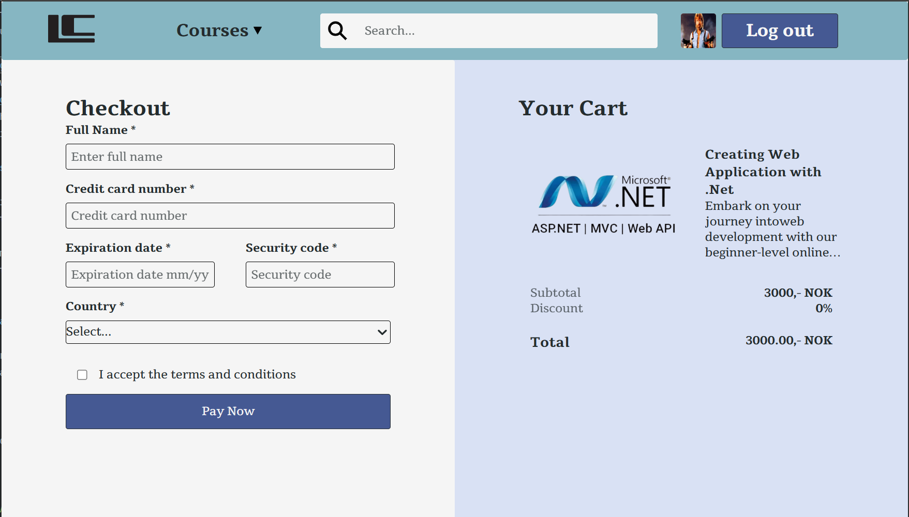
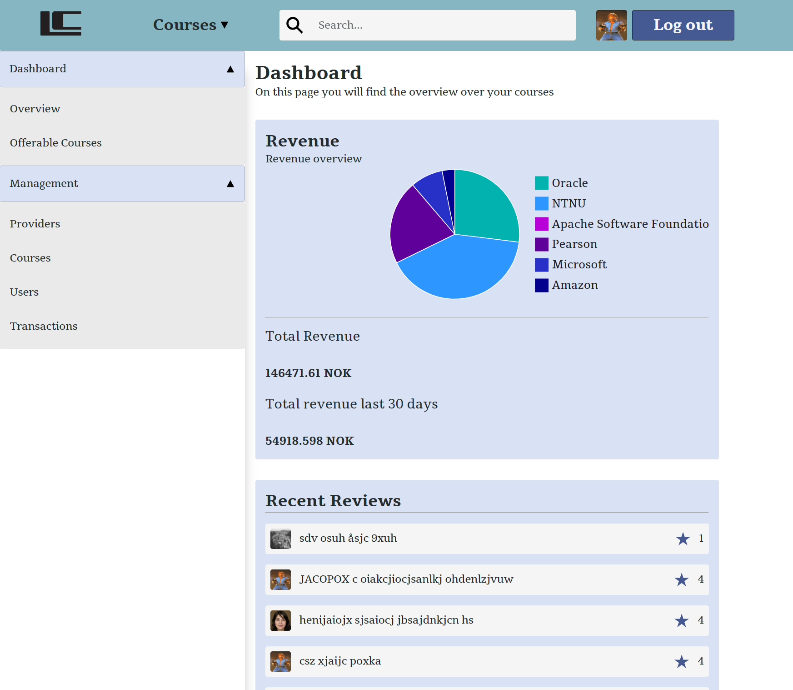

# Learninverse Frontend Application

This repo contains the frontend part of our application. The frontend is built using React Native and
JavaScript, and it communicates with the backend via REST API calls.

## Contributors
- Signe B. Ekern (SigneBek)
- Matthew R. Hunt (matrHS)
- August D. Oksavik (AugOks)

## Legal
This website is a result of a university group project, performed in the course  [IDATA2301 Web
technologies](https://www.ntnu.edu/studies/courses/IDATA2301#tab=omEmnet), at [NTNU](https://www.ntnu.no/). 
All the information provided here is a result of imagination. Any resemblance with real companies or products is a 
coincidence

## Description

In this project, we have created a web application for a make-believe company called Learninverse. The idea is to
emulate a real-life situation with the specification from a customer. The primary purpose of the portal 
is to help visitors compare prices and find the best supplier for their desired course. While company 
information should be available, the main focus is product search. The portal is designed to be user-friendly and
easy to navigate, as well as give the impression of a serious learning portal meant for professionals. 


## Starting the application

The frontend application is dependent on the backend REST application.
The backend application must be running for the frontend to work properly.
Go to https://github.com/NTNUFrokostklubben/IDATA2306 to find the backend application and instructions on how to run it.

It is necessary to have a .env file for proper functionality. The .env file should contain the following variables for 
development:

```
GENERATE_SOURCEMAP=false
HTTPS=true

REACT_APP_API_URL=https://localhost:8080/api
```

After cloning the repo locally, it is necessary to run `npm install` to install all the dependencies.

```bash
  npm install
```
Once the dependencies are installed, you can start the application by running:

```bash
  npm start
```
Open [https://localhost:3000/](https://localhost:3000/) to view it in your browser.

****

## Credits
This project uses [mui](https://github.com/mui/mui-x.git), licensed under the MIT License.

****

## Screenshots of the application





